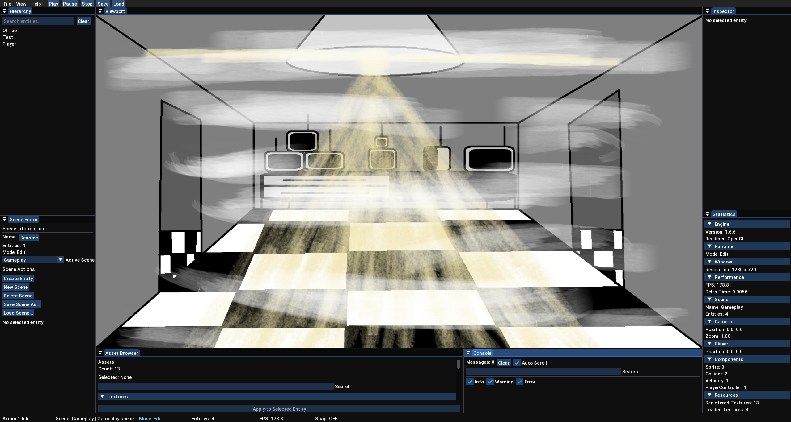

# Axiom Engine

[Русская версия](README_RU.md)

Axiom Engine is a lightweight 2D game engine written in C++17 using OpenGL.

The project is focused on 2D game development and learning the architecture of modern game engines.  
Its core systems include ECS, scene management, resource management, scene serialization, debugging tools, and an integrated editor.

## Editor

The Axiom Editor provides an integrated workspace for building and testing 2D scenes.

The editor includes a dockable workspace with tools for scene editing,
entity inspection, asset management, debugging, and runtime control.

It supports entity selection and manipulation, grid snapping,
scene creation and switching, scene serialization, file dialogs,
runtime interaction, and persistent editor layouts.

The editor also tracks the state of the current scene and protects
unsaved changes when opening, creating, switching scenes, or exiting.



## Features

- Rendering
  - OpenGL Renderer
  - Camera System

- Core
  - ECS (Entity Component System)
  - Scene Manager
  - Resource Manager
  - Asset Registry
  - Scene Serialization
  - Collision System
  - Timer System
  - Input System
  - Runtime System
  - Grid System
  - Snap System

- Debug
  - Debug Overlay
  - Debug Renderer

- Editor
  - Editor UI
  - Inspector Panel
  - Hierarchy Panel
  - Scene Editor Panel
  - Asset Browser Panel
  - Console Panel
  - Statistics Panel
  - Status Bar
  - Preferences Panel
  - Viewport Panel
  - Docking Workspace
  - Persistent Editor Layout
  - Editor Context
  - Scene Document State
  - Scene Dirty State Tracking
  - New / Open / Save / Save As
  - Unsaved Changes Protection
  - Scene Switching
  - Entity Selection and Manipulation
  - Grid and Snapping Tools
  - File Dialog Integration

- Runtime
  - Runtime Session Lifecycle
  - Play / Pause / Stop
  - Main Menu
  - Difficulty Selection
  - Gameplay Prototype
  - Enemy AI
  - Camera System
  - Power Management
  - Gameplay HUD
  - Win / Game Over States
  - Runtime Scene Transitions

## Technologies

- C++17
- OpenGL
- GLFW
- GLAD
- GLM
- ImGui
- ImGuiFileDialog
- stb_image
- CMake

## Project Goal

The main goal of Axiom Engine is not only to create a game engine, but also to understand how a game engine works internally.

The project is built around three directions:

- Game design — creating meaningful gameplay experiences
- System architecture — ECS, logic, balance, and extensibility
- Story and atmosphere — building deep and expressive game worlds

Axiom is being developed as a foundation for future original games with unique mechanics and presentation.

## Build and Run

### CMake

Clone the repository:

```bash
git clone https://github.com/axiom-dev-sys/Axiom.git
cd Axiom
mkdir build
cd build
cmake ..
cmake --build . --config Release
```

### Visual Studio

Open the project in Visual Studio 2022
Select the Debug or Release configuration
Build and run the project

## Current Status

Axiom Engine 1.6.x completes the Editor–Engine Integration stage.

The editor and engine systems now work through a more unified workflow
for scene editing, serialization, runtime testing, and project interaction.

The editor includes a dockable workspace, persistent layouts,
scene and entity editing tools, file dialogs, scene document state tracking,
and protection against losing unsaved changes.

The runtime provides Play / Pause / Stop controls, a main menu,
gameplay systems, enemy AI, power management, gameplay HUD,
difficulty selection, restart handling, and Win / Game Over states.

Axiom currently provides a stable foundation for developing and testing
2D games directly through its integrated editor and runtime environment.

The next development stage, Axiom Engine 1.7.x, will focus on
Project-Driven Development and evolving the engine around the needs
of an actual game project.