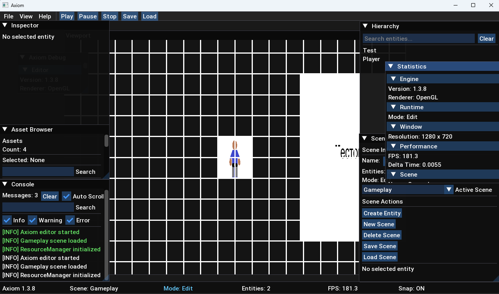

# Axiom Engine

[English version](README.md)

Axiom Engine — собственный игровой движок на C++17 с использованием OpenGL.

Проект ориентирован на разработку 2D-игр и изучение архитектуры современных игровых движков.

Основой движка являются:
- ECS (Entity Component System)
- система сцен
- менеджер ресурсов
- сериализация сцен
- инструменты отладки
- встроенный редактор

## Редактор

Второе поколение редактора Axiom.

Редактор теперь включает рабочий процесс на основе Viewport,
инструменты редактирования сцен, управления сущностями, ресурсами,
отладки и контроля Runtime.

Поддерживаются выбор и перемещение объектов, сетка, привязка,
управление сценами и инструменты разработки 2D-игр.



## Возможности

- Rendering
  - OpenGL Renderer
  - Camera System

- Core
  - ECS (Entity Component System)
  - Scene Manager
  - Resource Manager
  - Asset Registry
  - Scene Serialization
  - Collision System
  - Timer System
  - Input System
  - Runtime System
  - Grid System
  - Snap System

- Debug
  - Debug Overlay
  - Debug Renderer

- Editor
  - Editor UI
  - Inspector Panel
  - Hierarchy Panel
  - Scene Editor Panel
  - Asset Browser Panel
  - Console Panel
  - Statistics Panel
  - Status Bar
  - Preferences Panel
  - Viewport Panel

## Технологии

- C++17
- OpenGL
- GLFW
- GLAD
- GLM
- ImGui
- stb_image
- CMake

## Цель проекта

Главная цель Axiom Engine — не только создать игровой движок, но и глубоко понять принципы работы современных игровых движков.

Проект развивается сразу в трёх направлениях:

- Геймдизайн — создание интересных игровых механик.
- Архитектура — ECS, логика, расширяемость и структура движка.
- История и атмосфера — создание выразительных игровых миров.

Axiom развивается как фундамент для будущих оригинальных игр с собственной механикой и стилем.

## Сборка и запуск

### CMake

Клонируйте репозиторий:

```bash
git clone https://github.com/axiom-dev-sys/Axiom.git
cd Axiom
mkdir build
cd build
cmake ..
cmake --build . --config Release
```

### Visual Studio

- Откройте проект в Visual Studio 2022.
- Выберите конфигурацию **Debug** или **Release**.
- Соберите и запустите проект.

## Текущее состояние

Axiom Engine 1.3.x открывает второе поколение встроенного редактора.

Движок теперь предоставляет рабочий процесс на основе Viewport,
инструменты редактирования сцен, управления сущностями, контроля Runtime,
отладки и работы с ресурсами.

На данный момент Axiom включает надёжную основу для создания 2D-игр:
рендеринг, ECS, Runtime, систему сцен, сериализацию, инструменты
отладки и встроенный редактор.

Следующие версии будут сосредоточены на развитии игрового фреймворка,
архитектуры редактора, рендеринга и новых инструментов разработки.